# Greenwood-Library-website

## PROJECT OBJECTIVES 
Enhancing  greenwood community website-By adding a Book review section and updating the Events section

## INITIAL SET-UP
 1. We created a repository called the greenwood-library-website,made it public and added a README.md file.

 

 2.We cloned the repo into our local machine using git.

 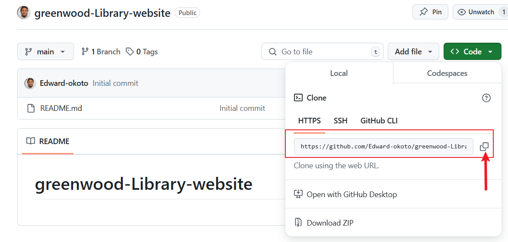
 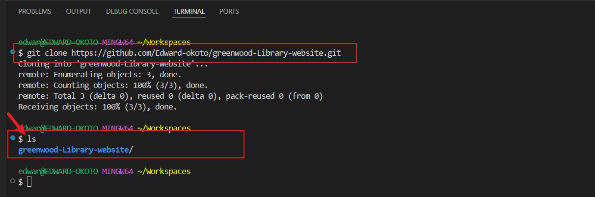

 TASK 

 1.We created about_us.html  contact_us.html  events.html  Home.html files on VSC and added content to these files

 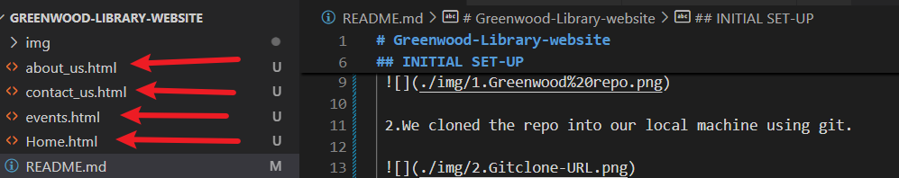

 2.Added the files to the staging area using the command `git add .`
   

 note: Before adding files to the staging area,the files would show a red coloration in the working area when you run `git status` and after adding the files,it would be green coloration.

Before staging

 

 After staging

 

 3.Commit and push the files to remote repository
 use the `git commit -m 'created-website-file` and use `git push` respectively.
  
 

# CREATING A BRANCH

## Objective

 In this section,we will simulate how two developers working differently create/update files,commit,push and raise a PR request before their work are merged into the main line of development. 

 ## Procedure

## Developer 1.
 1. Create a branch `add-book-review`
 2. Switch to the branch
 3. Add a new file to represent the book review section and  update the file with content
 5. Stage,commit and push changes with message 'Book review'
 6. Push the `add-book-review` branch to github
 7. Raise a PR for the work
 8. Merge the work to the main branch

 ## Create a branch `add-book-review`
use the command `git branch add-book-review` to create the branch called add-book-review
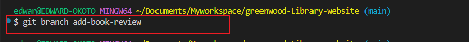

## Switch to the branch
Use the `git switch add-book-review` command to switch to the branch.

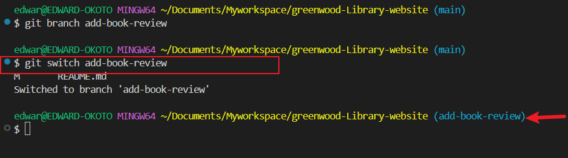

## Add a new file to represent the book review section 
add a file called book_reviews.html using `touch book_reviews.html` command and add content

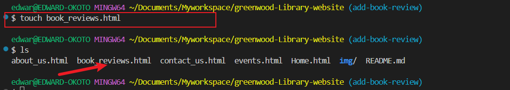

##  Stage,commit and push changes with message 'Book review

Use `git add .` to stage the file
use  `git commit -m 'add book review section`
use  `git push` to push to main branch

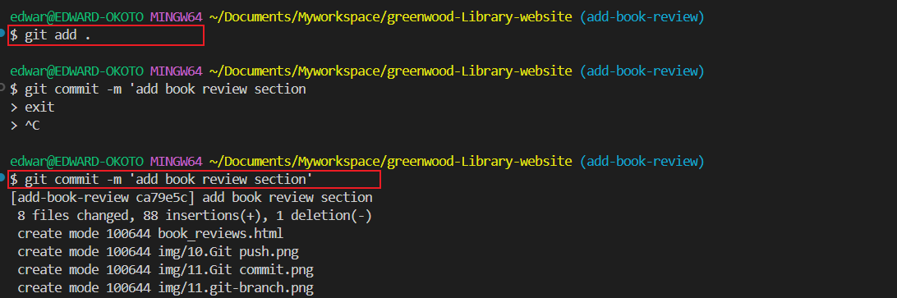
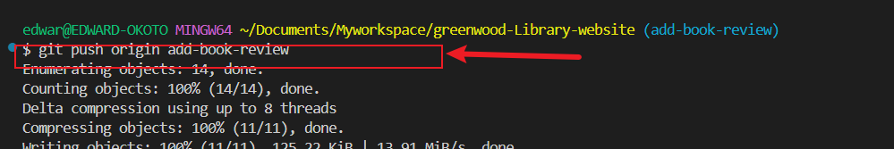

## Raise a PR for the work
To raise a PR go to the Github, and click  'compare & pull request'

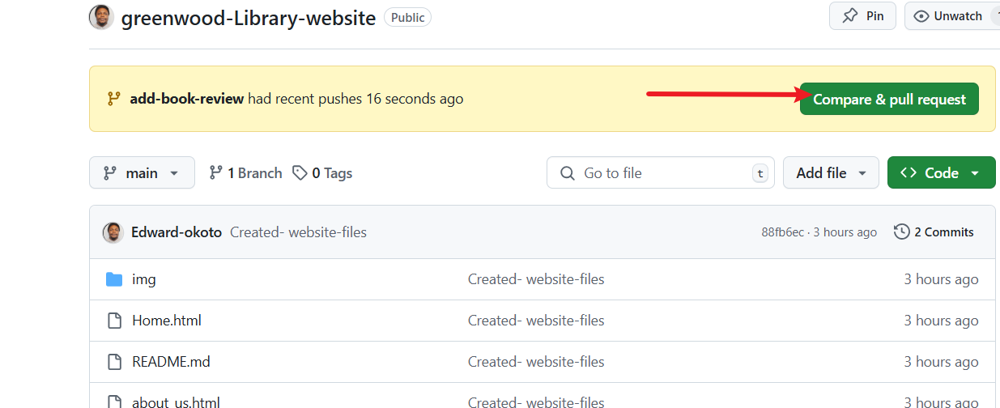

### Add a PR title and description and add the reviewers (colleagues/TL/Managers)

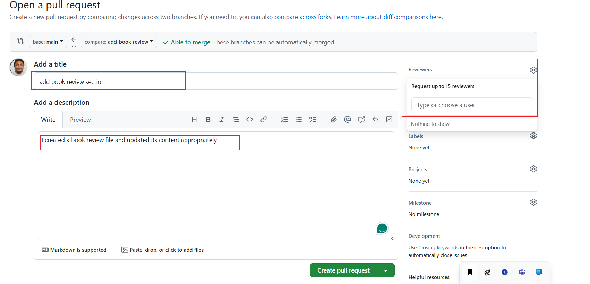

After review has been approved then click on the `pull request`,
Merge any conflicts,manually or automatically.

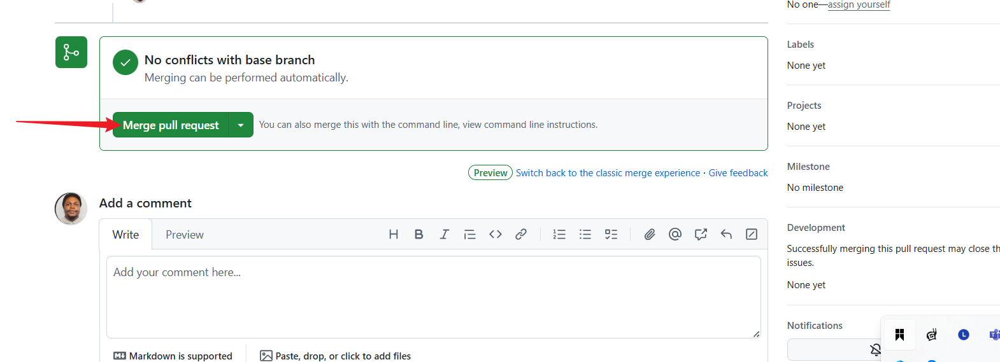
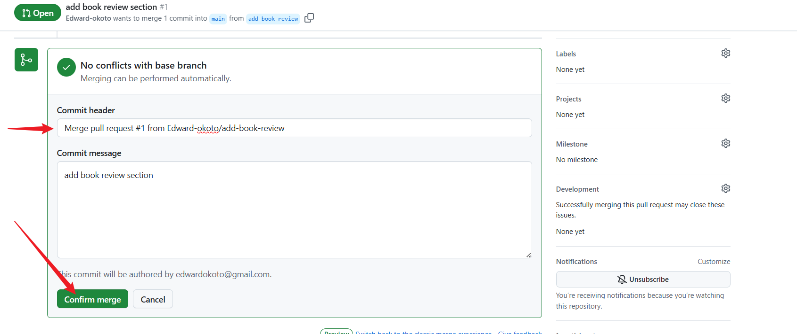

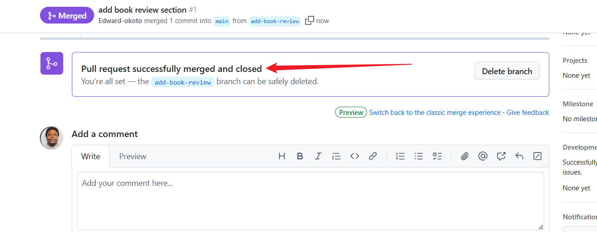

Delete the branch if NOT needed again.

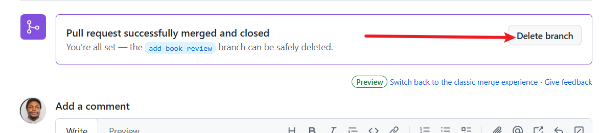

## Developer 2.
 1. Clone the current github repository
 2. Create a branch `update-events`
 3. Switch to the branch
 4. update the event file 
 5. Stage,commit and push changes with message 'Book review'
 6. Push the `update-events` branch to github
 7. Raise a PR for the work
 8. Merge the work to the main branch

 ## Pull the recent changes from github repo
 `git pull`
 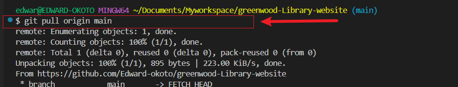

 NOTE: git If Developer 2 doesnt have the repository in the first instance,developer can clone the github repo as below

 ## Clone the current github repository
  `git clone https://github.com/Edward-okoto/greenwood-Library-website.git`

  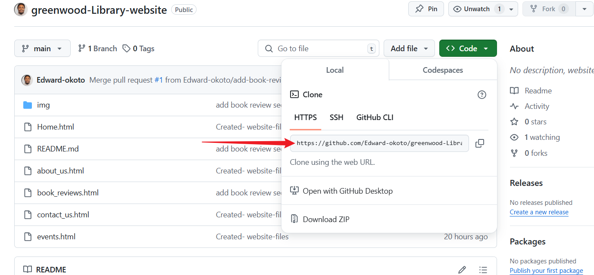 

  ## Create a branch `update-events`
  Use the command `git branch update-events` to create the update-events branch.
 ## Switch to the branch
Use the `git switch update-events` command to switch to the branch.

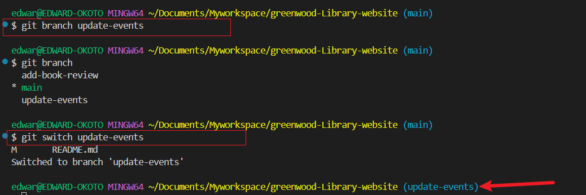

## Update the events.html file

##  Stage,commit and push changes with message 'Book review'

## Push the `update-events` branch to github

## Raise a PR for the work

## Merge the work to the main branch

 
 

 
